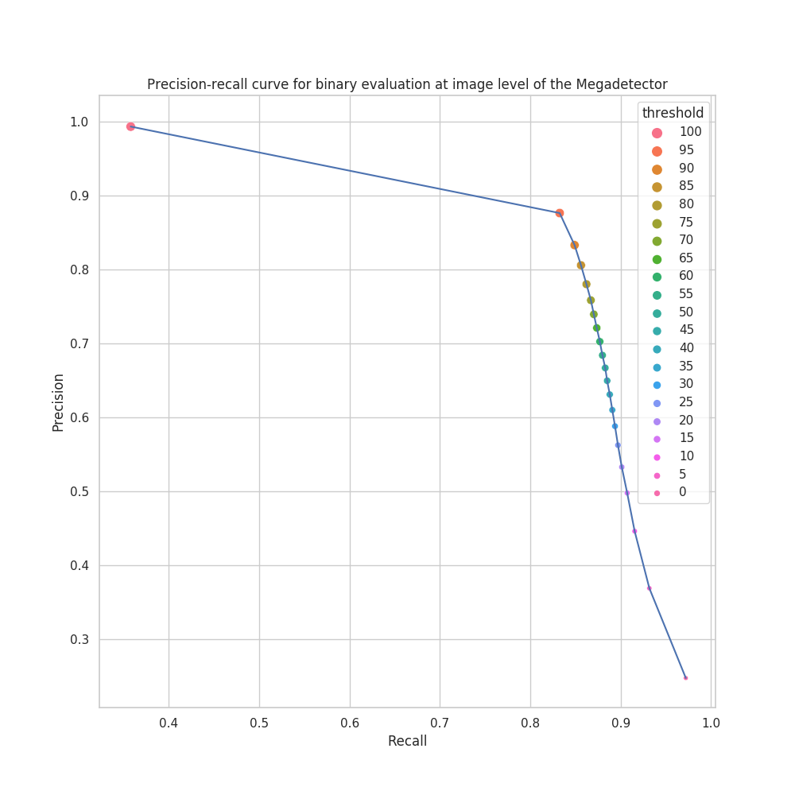
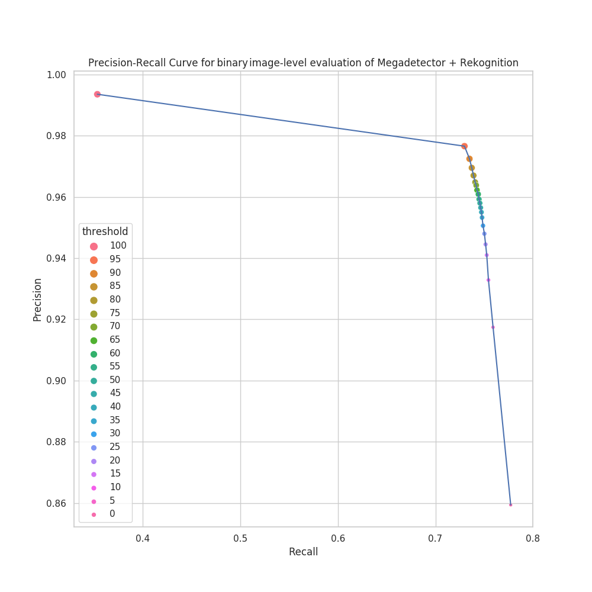

Pipeline for camera's images.

## Pipeline description

In this pipeline, the evaluation of two methodologies for filtering *non-fauna* in camera trap photos was performed. Both methodologies were evaluated using the same test dataset, consisting of *87,414* camera trap photos, which were obtained from public datasets hosted at [LILA BC](https://lila.science/datasets) and from the [SNMB collection](http://www.conabio.gob.mx/snmb_files/conabio_ml_collections/images/), of which 80% have the label `non-fauna`, and the remaining 20% belong to 77 species of medium and large mammals and birds. For the purposes of making a binary evaluation, these 77 categories were mapped to the label `fauna`.

### Megadetector as binary fauna/non-fauna classifier
The first methodology consists of using the Megadetector, an animal agnostic detector, to filter the photos that do not have fauna presence, as follows: if an image has at least one animal detection with `score ≥ threshold`, this image is assigned the label `fauna`, otherwise it is assigned the label `non-fauna`. Finally, the binary evaluation is performed, comparing this binary dataset at image level with the original test dataset, varying the score `threshold` of the detections to know the model behavior in terms of precision and recall for each value.

The precision-recall curve for the evaluation of this methodology is as follows:



### Use of an animal/empty classifier
The second methodology consists of using the `Animal` detections from the Megadetector to generate a set of crops with which to train the Rekognition. The detections were generated on *381,367* training photos (obtained from the same collections as the test set, but from different locations), 80% of which have no fauna. Crops whose detections are generated on the `non-fauna` labeled photos are assigned the `empty` label, while crops whose detections are from any of the 77 species photos are assigned the label species of each photo.
Once this model is trained, the evaluation of the test set is performed, using the same methodology described in the previous section, but adding a classification stage of the crops generated by the Megadetector on the test set, and using Rekognition to classify them, discarding the detections whose crop was classified by this model as `empty`.

The precision-recall curve for the evaluation of this methodology is as follows:



## Data input

Images are stored at `/sipecam/ecoinformatica/rekognition/5_use/` in sipecamdata server.

## Data output

`pipelines_kale/experiment_4/results/` directory of the repo `sipecam-models-images`, after lauching the process.

## Docker image 

`sipecam/ecoinf-tensorflow1-kale-gpu:0.6.1_2` see: [doc](https://github.com/CONABIO/kube_sipecam/tree/master/dockerfiles/ecoinf/gpu)

## Launch

1. Go to [cluster deployment](https://conabio.github.io/kube_sipecam/1.Deployment-of-Kubernetes-cluster-in-AWS.html#cluster-deployment) for scaling up worker nodes and components.

2. Clone the repo [sipecam-models-images](https://github.com/CONABIO/sipecam-models-images), go to the path `pipelines_kale/experiment_4/`, copy the `config.txt` file to `files`, and then run:
```bash
python3 pipeline.py
```

3. Scale down worker nodes and components: [scale-down-of-components](https://conabio.github.io/kube_sipecam/1.Deployment-of-Kubernetes-cluster-in-AWS.html#scale-down-of-components).

